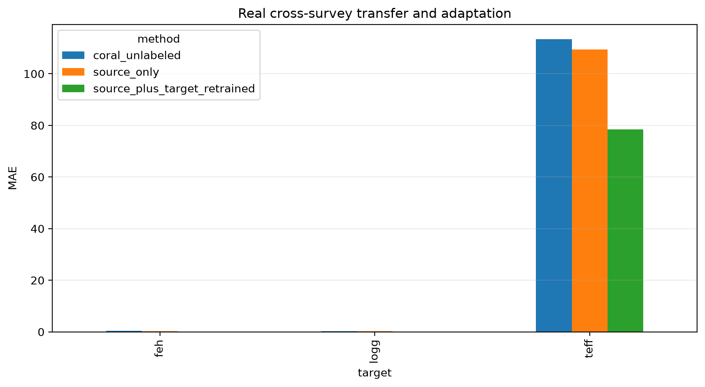
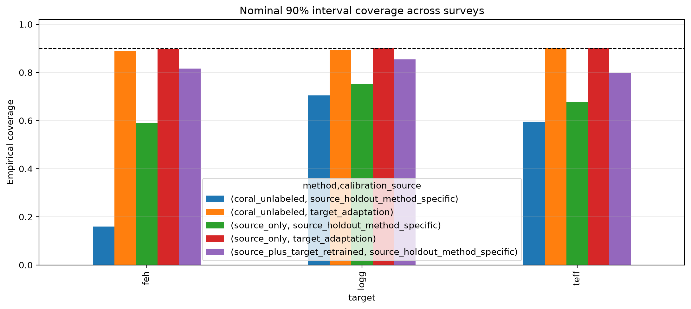

# StellarShift-Bench

**Executed LAMOST DR2→DESI DR1 transfer + controlled DESI S/N reliability benchmark**

StellarShift-Bench measures what happens when a stellar-parameter model leaves
its training survey. It audits accuracy, uncertainty calibration, adaptation,
out-of-distribution (OOD) risk, label efficiency, subgroup support, and physical
plausibility—not merely one aggregate score.

Version 1.2.3 closes the project's central evidence gap with a real,
prespecified quality-gated transfer from LAMOST optical spectra to disjoint DESI DR1
spectra. Both domains use the exact APOGEE DR12 ASPCAP v603 calibrated label
scale. The earlier controlled DESI noise experiment remains as a causal
measurement-shift reference.

| Evidence track | Status | Evaluation support |
|---|---|---:|
| LAMOST DR2→DESI DR1 real transfer | **Executed; gate passed** | 1,088 DESI stars |
| Controlled DESI R-arm S/N shift | **Executed** | 91 DESI stars × 10 noise seeds |
| Cross-survey calibration and adaptation | **Executed** | Same model-held-out 1,088-star set |
| Shared-label-support sensitivity | **Executed** | 918 DESI stars |
| B+R+Z feature fusion | Not executed | — |
| Isochrone-manifold plausibility | Implemented, not evaluated | — |

## Headline result: real survey shift is much larger than added noise

The source-only model is trained on 1,032 LAMOST stars, calibrated/evaluated
in-domain on a 259-star LAMOST holdout, and then transferred without DESI labels
to 1,088 model-held-out DESI stars.

| Target | LAMOST holdout MAE | DESI transfer MAE | Cross-survey change | 95% star-bootstrap CI on DESI MAE |
|---|---:|---:|---:|---:|
| `teff` | 52.5 K | 109.4 K | **+108.4%** | 103.2–115.4 K |
| `logg` | 0.124 dex | 0.260 dex | **+110.0%** | 0.240–0.279 dex |
| `[M/H]` | 0.073 dex | 0.250 dex | **+241.6%** | 0.228–0.270 dex |

By comparison, the controlled DESI experiment increased temperature MAE by
29.8% at 2× the recorded noise standard deviation. The real-transfer penalty is
therefore substantially larger, while the causal mechanisms are not assumed to
be the same.



The full-domain transfer includes both instrument/survey shift and population
support shift. Restricting evaluation to the 918 target stars jointly inside
the source-training `teff`/`logg`/`[M/H]` ranges reduces the source-only MAEs to
82.0 K, 0.163 dex, and 0.129 dex. They remain 56.3%, 32.3%, and 76.4% worse than
the LAMOST holdout, so unsupported labels do not explain the entire result.

## Adaptation, calibration, and label efficiency

| Method | Target access | `teff` MAE | `logg` MAE | `[M/H]` MAE |
|---|---|---:|---:|---:|
| Source only | none | 109.4 K | 0.260 | 0.250 |
| CORAL | 467 unlabeled DESI spectra | 113.5 K | 0.264 | 0.393 |
| Source + target retraining | 467 labeled DESI stars | **78.4 K** | **0.153** | **0.100** |

Labeled retraining improves all three targets by 28.3%–60.0%, with paired 95%
intervals excluding zero. CORAL is inconclusive for temperature and gravity and
causes detectable `[M/H]` harm (+57.5%). This directly demonstrates that an
adaptation method can help one problem setting and fail badly in another.

Source-holdout-calibrated nominal 90% intervals cover only 67.8% (`teff`),
75.2% (`logg`), and 59.0% (`[M/H]`) of target stars: the model becomes
overconfident under real shift. Using the 467-star target adaptation partition
for interval recalibration restores source-only coverage to approximately 90%
without touching target evaluation labels.



Small labeled budgets are not automatically safe. Across ten repeated draws,
five target labels increase median errors for all three parameters. At 100
labels, median MAE improves by 11.6% (`teff`), 31.1% (`logg`), and 46.0%
(`[M/H]`).

## Data contract and leakage boundary

- Source: 1,387 public high-S/N LAMOST DR2 spectra from the Ho et al. tutorial;
  1,291 pass the benchmark analysis-window quality contract.
- Target: 1,576 APOGEE DR12 stars position-matched within 1.5 arcsec to DESI DR1
  primary spectra; 1,555 pass the Redrock warning and spectral quality contract.
- Labels: calibrated APOGEE DR12 ASPCAP v603 `TEFF`, `LOGG`, and `PARAM_M_H` in
  both domains. The legacy `feh` slot contains global `[M/H]`, not elemental
  `FE_H`.
- Leakage: canonical `APOGEE_ID` is used across surveys; every target object is
  removed from source fitting before any split.
- Spectra: rest-frame 4000–5500 Å, matched to R=1800 with a declared Gaussian
  line-spread approximation; spectral sharpening is refused.
- Access: methods are tagged as source-only, unlabeled-target, labeled-target
  calibration, or labeled-target fitting.

The exact input hashes, query contract, duplicate rule, counts, and source URLs
are in `data/acquisition_logs/acquisition_manifest.json`.

## Install, test, and reproduce

```bash
python -m venv .venv
source .venv/bin/activate
python -m pip install --upgrade pip
python -m pip install -e ".[dev,desi]"
python -m pytest -q
```

The release has 51 deterministic unit, integrity, notebook, crossmatch, and end-to-end tests. Reconstruct the
public survey contracts using `data/README.md`, then run:

```bash
stellar-benchmark cross-survey-run --config configs/lamost_to_desi.yaml
```

The public configuration fails closed unless it has at least 1,000 source
training, 200 source holdout, 100 target adaptation, and 350 target evaluation
stars, including at least 50 giants and 50 metal-poor target-evaluation stars.
The executed run passed with 1,032 / 259 / 467 / 1,088, including 1,024 giants
and 55 metal-poor stars.

For a runnable tour, open
`examples/StellarShift_v1.2.3_Instant_Results.ipynb`. The report, one-page brief,
results, configuration, per-star predictions, and manifests are also archived
in the evidence bundle.

Build every public artifact and its checksum from one deterministic step:

```bash
python scripts/build_release.py
```

The command regenerates the notebook and PDFs twice to prove byte stability,
creates both ZIPs atomically with fixed metadata, verifies archive-member
identity, and writes `SHA256SUMS-v1.2.3.txt` only after every check passes.

## Why this is a benchmark rather than a model demo

- Frozen object-disjoint source/train and target/adaptation/evaluation splits.
- Per-star predictions and star-bootstrap intervals, not only point estimates.
- Paired same-star adaptation effects that separate inconclusive results from
  evidence of equivalence.
- Split-conformal coverage under shift and target-only recalibration audits.
- Formal APOGEE label-error propagation as a sensitivity analysis, explicitly
  not independent validation of the label scale.
- Shared-support, OOD risk-coverage, S/N, stellar-regime, estimator-family, and
  target-label-budget analyses.
- Fail-closed prespecified quality thresholds, immutable hashes, exact configuration,
  target-access taxonomy, and machine-readable limitations.

## Scientific limits

The common APOGEE labels provide a consistent reference scale but are not
independent ground truth; shared ASPCAP systematics can remain. The target set
is dominated by giants and DESI backup-program spectra, while the Ho tutorial
source is intentionally high-S/N and lacks stars below `[M/H] = -1.5` after
quality cuts. Consequently, the primary effect combines instrument, reduction,
S/N, and population/covariate shift; the within-support table is the narrower
sensitivity analysis. Resolution matching uses a Gaussian approximation rather
than per-spectrum line-spread matrices. Hard physical bounds show no violations,
but no cited population-appropriate isochrone grid was supplied, so
isochrone-manifold consistency remains not evaluated.

See `docs/METHODOLOGY.md`, `docs/CRITIQUE_RESPONSE.md`, and
`docs/CROSS_SURVEY_RUNBOOK.md` before quoting results.

References: [Ho et al. (2017)](https://doi.org/10.3847/1538-4357/836/1/5),
[The Cannon public LAMOST tutorial](https://annayqho.github.io/TheCannon/lamost_tutorial.html),
[DESI DR1](https://data.desi.lbl.gov/doc/releases/dr1/), and
[NOIRLab DESI/SPARCL access](https://datalab.noirlab.edu/data/desi).
